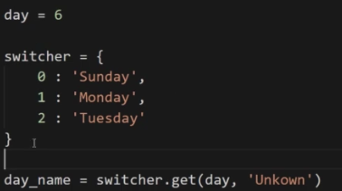
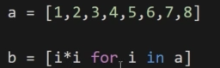
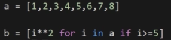
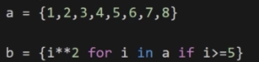
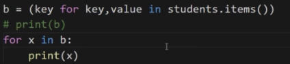
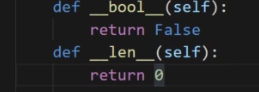
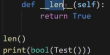
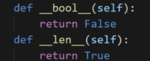
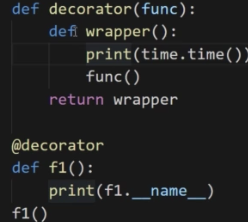
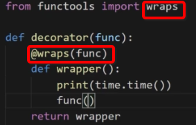

# Pythonic与Python杂记

1.字典代替switch

 
使用下标的方式访问字典,不存在这样的key时会报错 
使用`get`方法的好处是当key值不存在时,会返回设置的内容

由于在其他语言的`switch语句`中,各个`case`内部是可以有一个代码块的,故上述方式还不够好,可以使用函数替代 
1)python中字典的value可以是个函数 
2)定义对应数量的函数和一个默认函数(当取值取不到时使用,类似于`case语句`中的`default语句`,在`get`函数将`’Unknown’`替换为默认`函数名`),在get函数后加上()并执行

2.列表推导式 
作用:根据一个已经存在的列表创建一个新的列表

 
一个简单的列表推导式,令b生成一个所有元素都是a平方这么一个数组,前面的`i*i `及需要的表达式 
注:i的平方也可以写作`i**2`

 
当如上需要有选择性的筛选推荐使用列表推导式,结果为[25,36,49,64]

 
集合也可以进行列表推导式,所得的结果也可以是集合.同理,字典和元组也可以使用列表推导式

字典需要调用`items()`方法才可以被for in遍历

 
当结果为元组时,b实际为一个对象,因为元组是不可变的,故操作上也是与列表/字典等可变的操作不同.这里也不建议使用元组

3.None 
None与空字符串,数字0,空列表的值和类型都不相同 
None的空也是一个对象(与swift一致),即有个NoneType类型

推荐使用的判空操作推荐使用if a和if not a的方式

None对应的真假关系为:None永远为假

并非所有的对象存在都是true 
至于是True还是False,与函数中是否定义的以下两个方法有关,因为其会影响方法的bool取值

 
若无上述两个方法.默认打印的是True 
`__len__`函数只能返回int类型数或bool类型,该对象是True还是False,与返回的结果有关

 
下部分两个函数会调用`__len__`方法 
当方法没有定义`__len__`方法时,外部就不能调用len函数

 
当两个内置函数返回的值不一致时,对象的真假与`__bool__`内置函数一致,因为此时是不会再调用`__len__`方法的

4.装饰器的副作用

 
此时,f1的名字为wrapper 
使用装饰器时,函数的函数名是会被改变的 
想要解决该方法,需要导入`wraps模块`

 


