# Python中的函数

Python的函数

round函数:保留一个数字小数点多少位,后续四舍五入 
例如:a = 1.123455  则round(a,2)的结果为1.12

函数的特性:
　　　1)功能性   
　　　2)隐藏细节 
　　　3)避免编写重复的代码 

函数的定义: 
`def 函数名称(参数列表):` 
　　`代码块` 
    
注意点:1)参数列表可以没有 
      2)可以使用return一个value(若不使用return,则默认为return None) 
	  3)return 语句后的语句是不会执行的 
	  4)可以返回任意类型 
	  5)可以通过return A,B….返回多个值,之间用逗号隔开,类型默认为元组


设置最大递归的次数 
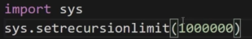

---------------- 
def printf (code): 
    print (code) 

print (printf(3)) 
---------------- 
结果为:3 
	   None

原因是:一开始执行上面的print,打印3,后由于函数定义并无返回值,故打印为None

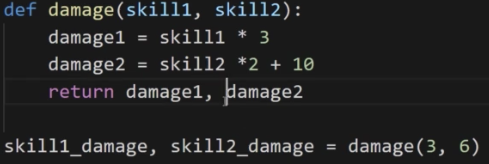


通过如上的序列解包,比通过索引的方式获取元组中的值来的有利

python可以如下赋值:

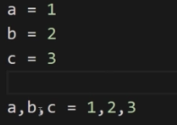

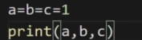


也可以这样赋值: 
d = 1,2,3  则d的类型为元组tuple 
则序列解包为: 
a,b,c = d 
注:解包的数量需与元组中元素个数相同 

函数的参数: 
1)必须参数:最普通的函数中参数均为必须参数,不能遗漏或者添加 
2)关键字参数:明确指定实参对应为对应的形参,有利于代码的可读性 

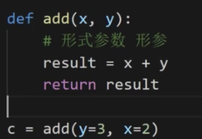


注:二者的区别在于函数的调用上,而不在函数的定义上 
3)默认参数: 
直接在形参后面通过等号赋予一个默认值

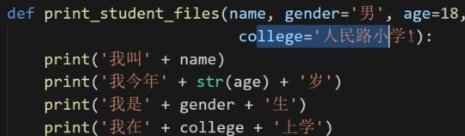


默认参数的注意点: 
1.非默认参数不能放在默认参数的后面 
2.当不遵守顺序时,使用关键字参数解决 
3.不能够将默认参数与必须参数混合调用

4)可变参数,通过*可以传入可变的参数 
也可以正常调用普通定义函数的方式,向其传入一个元组


也可以这样: 

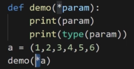


*a的作用是可以将元组a的每个元素平铺出来再赋值进去

但假如是这样定义:

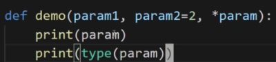


需要注意的,必须参数必须在最前面 
但这样是行不通的,会使第二个默认参数必定会有东西,故可变参数和默认参数必须颠倒位置,并使用关键字参数确定param的参数

原则上函数的参数列表的参数类型不需要太复杂

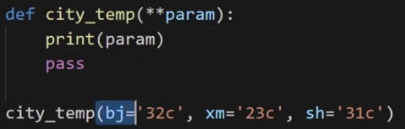


通过两个*,可以包装参数为字典类型,就可以实现通过关键字可变参数

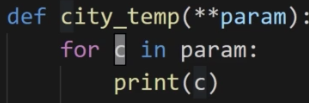


若单一的将参数列表中的每个元素取出,则只会取出字典的每个键

若

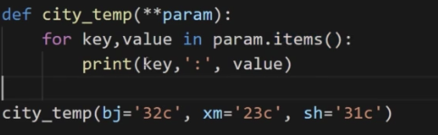


结果为:

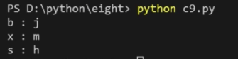


要遍历一个字典,则:可以使用一个items方法

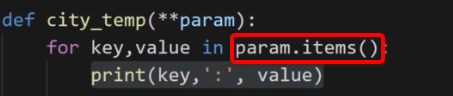


同样,当传入的是个字典时,可以使用**进行,与普通的可变参数对应

可变参数可以什么值都不传入

函数内部的变量为局部变量,其作用域仅仅在函数内部,外部无法使用

for循环外部是可以使用for循环内部的变量

python中是没有块级作用域的概念

作用域链:作用域是逐级寻找的,故被称之为作用域链,而引用在for循环外部引用for循环内部的变量不属于作用域链,因为python没有块级作用域的概念,故for循环不属于单独的一个作用域

在python的模块中直接定义一个变量都是全局变量

可以使用global关键字,将局部变量也可以供外部使用,同时该变量也变为全局变量

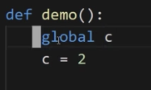


