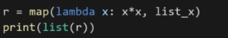
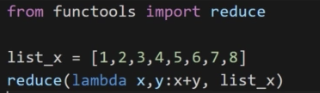
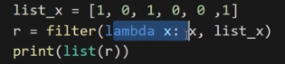
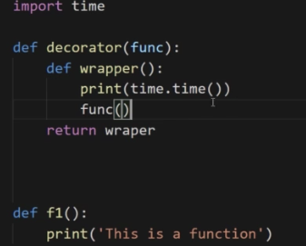
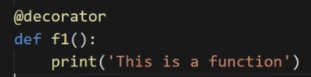
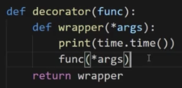
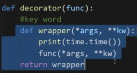

# Python中的函数式编程

Python中的函数式编程

函数的基本定义方式:</br>
```def add(x,y):
    return x+y
```
调用:`add(1,2)`

匿名函数:(后边的表达式只能是简单的表达式,且只能是表达式,且不需要return语句),也有其他称之为`lambda表达式`</br>
`lambda x,y: x+y`</br>
调用:`f = lambda x,y: x+y`</br>
　　　`f(1,2)`

三元表达式:</br>
伪代码形式: `条件为真时返回的结果 if 条件判断 else 条件为假的时候返回的结果`

`map`类:结果为对象,将列表中的每个元素在函数中进行映射,得到一个结果并输出</br>
定义:`map (函数,列表)`</br>
注:后边的列表项是可变参数,可以多传几个参数 
     
可以将`lambda`函数与`map`类相结合

</br>
注意点:</br>
　1)后边的列表个数应该与lambda表达式传入的参数个数相同</br>
　2)当列表内元素个数不一致时,结果也只会和对应少的元素个数相同,即`list_a = [1,2,3,4,5,6],list_b = [1,2,3,4]`,则结果也只有前4个的运算结果

`reduce`:`reduce`中的函数必须要有2个参数,结果为一个值

</br>
reduce的规则:连续计算,会连续调用lambda表达式,即每次都将上一次运算的结果,作为参数再一次进行计算,上述结果为36</br>
第三个参数为初始值,它是第一次就参与这个操作

`filter`类:与`map`类似,都是一个集合对象

</br>
`filter`的`lambda`表达式只需要返回真和假就行  

导入`time`模块,调用`time.time()`可以获取当前时间,结果为一个`unix时间戳`</br>
注:编程核心应该对修改是封闭的,对扩展是开放的

一个装饰器的简单使用:

</br>
</br>
此时,只需要在原先的f1函数上加上`@装饰器的名称`,就可以保持原来的调用方式不变

当装饰器与特定的函数绑定是没有意义的</br>
故可以在装饰器中添加可变参数 

</br>
当函数包含关键字参数时,可以在装饰器中添加关键字参数

</br>
装饰器的优点:</br>
　　1)不需要破坏代码的实现</br>
　　2)代码的封装性

一个函数可以有很多个装饰器

