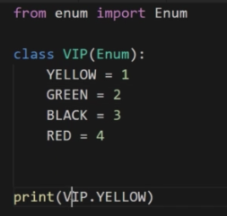
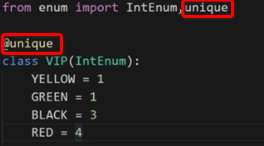
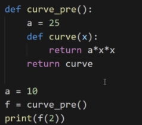
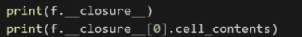
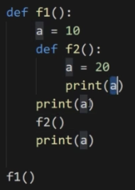
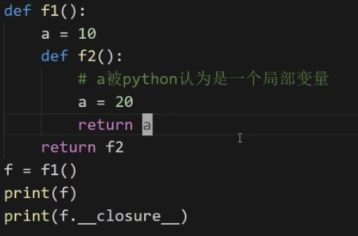
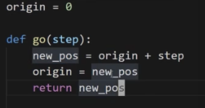

# Python中的枚举及闭包

 
枚举： 
　1)在python中,枚举是一个类,自定义的枚举其实是`Enum`的子类 
　2)后面可以使用点语法获取枚举值 
　3)其打印的结果依然为`VIP.YELLOW` 
　4)定义枚举类的变量建议都大写(标示常量)

可以使用字典或者普通的类实现枚举的功能,但存在2种问题 
　1)可变,可轻易地更改取值 
　2)没有防止相同标签的功能,即取值可以相同 
　在枚举中,若出现变量名相同相同时,会报错

以上实例,可以通过`VIP.YELLOW.value`可以获取枚举的值 
通过`VIP.YELLOW.name`获取枚举中标签名

`VIP.YELLOW.name` 对应的是标签的名字(枚举名称),为`str` 
`VIP.YELLOW `对应的是枚举类型,为enum 的`VIP类型` 
通过枚举名称是可以获取枚举类型的,即`VIP[‘YELLOW’]`

可以通过`for循环`遍历枚举类型

枚举类型是不能做大小比较的,只能做等值比较,也可以通过`is`关键字做身份比较

若在枚举中出现值相同的枚举类型,则后一个会被视为前一个枚举类型的别名,并不会被视为一个独立的枚举,若通过`for`循环是不会被遍历打印出来的,但要遍历别名也是可以的,通过调用`枚举名.__members.items()`的方式遍历,若去掉`.items()`时,可以获取全部的枚举标签

在数据库中建议存枚举值,在代码中建议使用枚举类型

若已经知道具体的枚举值.可以使用`枚举名()`的方式进行转换,即上述若知道`a = 1`,则转换为具体的枚举类型为`VIP(a)`

1)通过继承`IntEnum`,让枚举的取值只能是`int类型`

 
2)若需要限制枚举中的值不相同,通过引入`unique`,并加上`@unique`修饰器

枚举类型在python是单例实现的,因而是不能实例化的

python的一切皆对象 
其他编程语言中,函数只是一段可执行的代码,并不是对象

python中可以将函数作为参数传入另一个函数中 
也可以将一个函数作为返回结果返回出去

 
结果依然为`100`

闭包:函数+环境变量(环境变量是函数定义时候,且必须在函数外部,且不能是全局变量),可以记忆现场(上一次调用的状态) 
上图中`a = 25`就成为环境变量 
实际上,上图返回的`curve`返回的是一个闭包

 
上图的第一个打印闭包,第二个打印闭包的环境变量

 
结果为`10 20 10`,前两个很明显,第三个是10是因为f2中对a进行了赋值,会被系统认为是一个局部变量,局部变量时不会影响外部的变量的

 
不能被当做一个局部变量被赋值,在f2中需要引用外部,只有这样才能被当做是一个闭包

当函数内部定义时出现A = B,则等号左边的变量A会被认为是局部变量,就不会延作用域链去外边寻找A的定义和取值

 
如上图,origin在定义时就被认为是一个局部变量,不会再去外部寻找全局变量,故在运行时由于找不到origin,导致报错

`nonlocal` 关键字可以令一个变量不为本地变量(局部变量)
