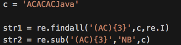
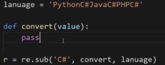
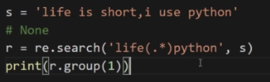
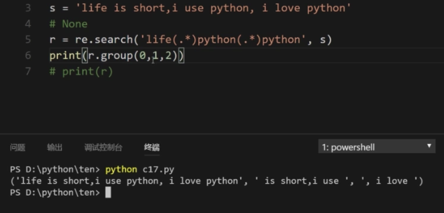
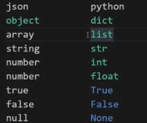

# Python中的正则表达式及JSON

正则表达式: 
　概念:是一个特殊的字符序列,一个字符串是否与我们所设定的这样的字符序列相匹配 
　作用:1)快速检索文本 
 　　　2)实现一些替换文本的操作

index()函数含义: 
　　可以用于判断某个字符串是都包含index后面的函数,若大于-1,则代表包含

in函数也可以判断

通过导入`re`包,通过`re.findall(‘正则表达式’,字符串)` 
例: `a = c/c++/python` 
则判断c++是否在`a`中,可以写为:`r = re.findall(‘c++’,a) `
打印`r`值,`r`是一个列表 
当`r`的长度大于0,及`len(r) > 0`,则`a`中是包含`c++`的

正则表达式`\d`可以表示`0-9的数字` 
　普通字符:`’c++’`这种即为`普通字符` 
　元字符:`’\d’`即为`元字符`,代表`数字` 
　　　　　`‘\D’`代表非数字

　`a[cf]c`,这个即是普通字符与元字符的定界,意义上匹配所有首字母为a,尾字母为f,中间为c或f的字符串 
　`a[^cf]c`, 这个即是普通字符与元字符的定界,意义上匹配所有首字母为a,尾字母为f,中间不为c或f的字符串,^即为取反的操作 
　`a[c-f]c`,这个即是普通字符与元字符的定界,意义上匹配所有首字母为a,尾字母为f,中间为c到f的字符串,即匹配字符含acc,adc,aec,afc

字符集的特性: 中括号`[]`中的字符是`或`的关系 
字符集或概括字符集只能匹配`单一`的字母(字符) 
中括号中的`.`和`*`代表符号本身的含义

　`\w`:只能匹配数字或者字母或者下划线(单词字符) 即`[A-Za-z0-9_]` 
　`\W`:只能匹配非单词字符 
注意:`空格`,`回车`等都属于非单词字符

　`\s` :匹配空白字符(空格/回车/制表符等) 
　`\S`:匹配非空白字符

　`. `:标示除`换行符\n`之外的其他所有字符

数量词:`{n}`中的数字代表n个字符一组 
数量词也是支持多少到多少,中间用逗号隔开,{3,6}标示3个到6个字符一组 
`*`:标示匹配`*`前面的字符`0次`或者`无限多次` 
`+`:标示匹配`+`前面的字符`1次`或者`无限多次` 
`?`:标示匹配`?`前面的字符`0次`或者`1次` 

贪婪与非贪婪: 
　贪婪:尽可能多的匹配到数量词规定的最大字符数量,可以理解为从右边开始匹配 
　非贪婪:在数量词后面加上`?`,即`[a-z]{3,6}?`,可以理解为从左开始匹配 
  可以这么理解:贪婪为尽可能的寻找右边符合要求的匹配,而非贪婪为尽可能寻找左边符合要求的匹配

注:有关`?`: 当作为`数量词?`,前面为一个固定的`普通字符` 
　　　　　　　当作为`数量词后`,即为`非贪婪`,注:?是跟在数量词后面的

边界匹配符: 
　在表达式首部加上`^`,在尾部加上`$`,即匹配完整的字符串,`^`标示从头开始匹配,`$`标示从尾部开始匹配

组: 
　使用括号将一个字符组合起来:`(python){3}`,表示查找`pythonpythonpython`
　`[]`中的每个字符是或的关系,`()`中的每个字符是且的关系

 
上图中,str1的结果为`AC`,str2的结果为`将ACACAC替换为NB`

匹配模式参数:在`re.findall`中第三个参数即为匹配模式参数, 
当设置为`re.I`时,忽略匹配字符的大小写 
当设置为`re.S`时,则字符集中的.标示包含`\n`在内的任意字符 
实际用例:`re.findall(‘abc.{1}’,str1,re.S)`标示查找abc外加任意一个字符(类似数据库查找)

匹配模式多个时,采取`|`来进行并列,标示的是`且`关系

`re.findall`查找字符串 
`re.sub`将字符串进行替换,简化版即为`replace`函数 
`re.sub`参数含义: 
　第4个参数:匹配之后能被替换的最大次数,默认为0,即无限匹配下去 
　第2个参数,即替换为的字符串参数可以是函数,含义是,会将language中的`C#`传入函数中作为参数,后将函数的返回值用于替换language中的`c#`

 
其中`value`是一个对象,通过`value.group()`获取替换的字符串 
作用是对不同匹配的结果做不同的操作 
注:通过函数返回的也必须是`字符串类型`,因为`sub`函数接受的是字符串

`match函数`:尝试从字符串的首字母进行匹配,若无结果,则会返回空
`search函数`:尝试搜索整个字符串,并将第一个结果返回
`match`和`search`返回的是个对象
注:除了对象调用`group函数`获取值之外,还能使用`span函数`获取对象在字符串中的位置
二者共同点:当找到满足要求的字符串时,立刻停止匹配
推荐使用`findall`进行查找匹配操作

注:不能对`None`调用`group函数`
`group函数`的`group(0)`永远记录一个表达式的完整匹配结果

 
结果为` is short,i use python `

可以这样使用

 

可以使用`groups()函数`,直接会过滤`group(0)`的情况

注:要求例如`’123AAAA456’`,想获取123和456中间的全部内容,可以使用`’123(.*)456’`来获取
默认任何一个字符串外边都有一个圆括号,将其所有的字符串变为一个组,即`(123AAAA456)`

`JSON`:是一种轻量级的数据交换格式
字符串时JSON的表现形式
符合JSON格式的字符串叫做JSON字符串,是JSON的载体

导入`json` 通过`json.loads`函数可以解析JSON,json对象返回结果是个`字典`,json数组返回的结果是个`列表`
注:JSON的对应不能使用`单引号`,只能使用`双引号`

将json字符串转换成某种语言的数据结构,称之为`反序列化`

python与JSON的类型转化对应关系

 
`json.dumps()`方法进行json的序列化操作

