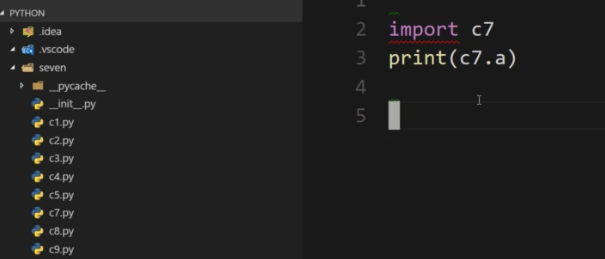
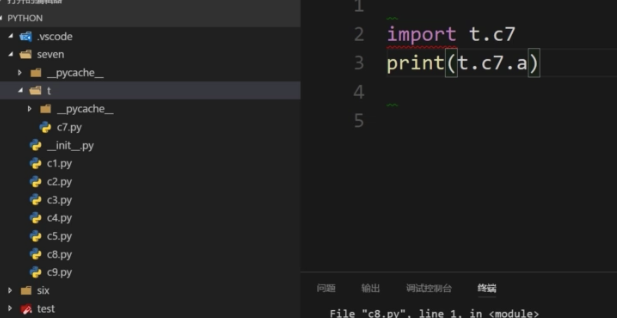
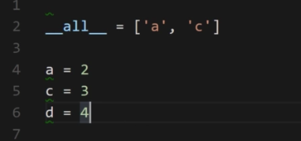

# Python的循环语句及包导入相应内容

Python的循环

while语句及for语句:

1.while语句: 
while与if语句类似,当后面的表达式成立时,执行后续代码块不同的是,if语句后续执行完代码块后是会退出if语句,而while会一直执行后续代码块

while也可以和else配合使用

当需要使用递归操作时,多使用while,其余情况使用for居多

for循环主要是用来遍历/循环 序列或者集合、字典

****print函数默认打印出的每个元素是换行的,当要实现同一行显示,则可以表示为print(x,end = ‘’)

for也可以与else配合使用

break可以跳出循环,break后的所有代码都不会执行
continue可以跳过单个条件的循环,当前的代码块不会执行

>当使用break时,即使后续有else也不会执行

一个break只会退出一层循环

python中for(i= 0; i<10,i++)
{

}
的替代方式是:for x in range(0,10)

注:range(0,10)只会标示0-9,后面的10标示偏移量
当要求是只打印偶数时,可以改为range(0,10,2)
最后一个数字表示的含义为步长

当要表示从10到0的递减序列,可以写成range(10,0,-2)
注:最后一个步长可以是负数

a = [1,2,3,4,5,6,7,8]
当要求是打印a中所有的奇数这一要求时,除了可以使用for循环外,还可以使用步长的概念,即:
b = a[0 : len(a) : 2]; 最后一个元素即为步长

python项目的组织结构
包—>模块—>类(函数变量属于类中的特性)

python中使用文件夹来表示一个包的概念

命名空间用于区分不同包的同名模块,可以用”包名.模块名”的方式

****python区分普通文件夹和包:是包的话,一定要有一个__init__.py,其本身也是一个模块

import用于导入模块,即import后面只能跟上模块名
注,1)import只能导入模块,不能直接导入模块内的变量或者函数
2)要调用模块中的变量或者函数必须要用点的方式
3)可以使用as关键字将前面的组织路径重命名为一个变量名,即import t.c7 as new_bag ,后续使用木块内的函数或者变量,只需通过new_bag.xxx进行获取即可

可以使用该方式,在c8文件中使用c7的内容(c7和c8同级)


当c8与c7不在同级时



可以使用from 模块路径 import 具体变量  简化
后续可以直接使用具体变量
即以上可以改写为from t.c7 import a,后续可以直接使用a

当一个模块中有多个变量时,可以使用 from t.c7 import *的方式导入c7中的全部变量,,但不建议这么写


可以在c7文件中添加__all__ = 的方式控制当其他文件中使用*导入时导入的对象,同样也可以导入包内的全部模块
__all__成为模块的内置模块或模块的内置属性

p.s 可以通过file.exclude中添加pycache方式来令该文件隐藏

可以在import中通过逗号(,)的方式,将模块中的变量或方法一次导入

可以通过在末尾添加反斜杠(\)的方式实现代码换行(不推荐)
推荐在被导入的变量前加括号()的方式进行换行

可以直接导入一个包,会自动导入包内的全部模块

__init__.py文件会在导入包或者模块时自动运行,无需手动运行
作用:1)在__init__.py文件中添加__all__ = [‘模块名’]的方式,在其他模块使用*导入模块时,限制调用包内的某些模块
2)可以在__init__.py中批量导入公用的库

1)包和模块是不会被重复导入的
2)要防止循环导入

python中导入一个模块的时候,就会执行该模块的代码

dir函数用于返回当前模块的变量
(当想要查看某个类中的模块变量时,可以使用dir(sys)等,可以查看sys内的模块变量)

内置函数:__name__  :当前模块的完整名称(命名空间)
		__package__:包名
		__file__:当前模块在系统中的物理路径
		__doc__:模块的文档注释内容

若一个py文件被当做入口文件时,
__name__结果都为__main__
__package__结果为当前模块是不属于任何包的
__file__则直接为当前文件名.py(即运行时,python后接的东西)

—————————————————————————
__name__内置函数的经典作用
“
if __name__ == ‘__main__’
	代码块
“
来判断该py文件是入口文件还是导入的模块
—————————————————————————

python -m 可以将一个py文件当做一个模块处理,值得注意的是,需要将文件路径调至该级的上一级

模块的顶级包是与入口文件的位置有关....

绝对导入的绝对路径必须从顶级包开始
相对路径中 .标示当前目录,..标示上级目录,…标示上上级目录
可以通过from import的方式进行相对导入,但无法再入口文件使用相对导入,原因是若直接使用,会直接将.的部分转换为__main__,从而找不到路径,且不能超过顶级包