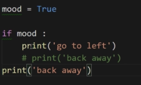

# Python的表达式及条件语句

Python的表达式

•C语言的表达式的定义:表达式是运算符和操作数所构成的序列

若运算符是同级时,解释器是从左向右 
可以使用`()`强行提高优先级

`not a or b + 2 == c`的优先级为` (not a) or ((b + 2) == c)` 
逻辑运算符的运算优先级为`not > and > or`

　1.python可以不使用封号 
　2.python不需要使用`{}`将代码块包裹,而是使用`缩进`进行代码的区分

•可以使用`#`进行单行注释,也可以使用`’’’`和`’’’`进行多行注释

 

•条件语句无需大括号`{}`,但内部需要加上缩进代表一个代码块

•`if`后不止只是一个变量,也可以是一个表达式

•python建议使用`_`来分隔字符,而不是驼峰

`input()`函数,可以令用户进行输入,默认会将输入的类型为字符串 
注,当使用`input()`函数时,会报错`NameError: name 'das' is not defined` 
解决方式:将`input()`函数修改为`raw_input()`函数 
区别：  
　input：会根据用户的输入来做类型的转换  
　raw_input：则会把用户的输入都作为一个字符串来处理  
为了避免引起不必要的麻烦，推荐使用`raw_input`

•由于python中并无确切常量的定义,即所有都为变量,故要有常量的概念时,需要将名称所有字母都改为`大写`

•python中的缩进为4个空格,需确保一个代码块的缩进为4个空格

•`snippet`: 片段,用于提高开发效率

•`if`可以单独使用,但是`else`不能单独使用

`pass`语法:为空语句/占位语句 
作用是占位,令编译器不会报错

•若嵌套太多层,可以将内部的代码封装提取成函数,更加符合面向对象的思维而不是面相过程

•python中的代码块是使用缩进来进行标示的

`elif`即为`else if`,用法即使用与`else if`一致 
`elif`也不能单独使用,必须在`if`语句中使用

•注:python是没有`switch`语句的