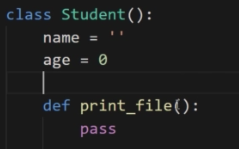
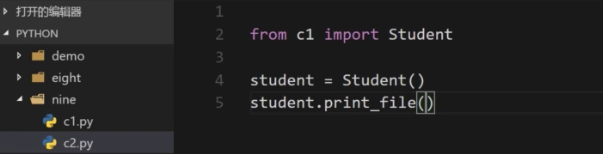
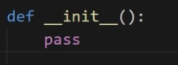
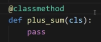
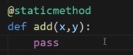
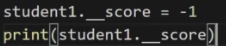
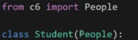
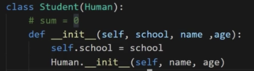
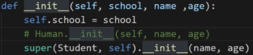

# Python的面向对象

类:使用关键字class 
注意点: 
1)类名的首字母大写,若有多个名称,则每个名称的首字母都大写,及StudentName等

 
2)类中可以定义数据成员和方法 
3)实例化方式:变量名 = 类名() 
　　如上:student = Student() 
　　调用类中方法,student.print_file() 
4)类中方法,在参数位置需要加上self,若需要在方法中使用类中定义的其他变量,需要使用self.变量名的方式 
5)类最基本的作用:封装 
6)类只负责刻画,而不能直接在类中进行方法调用 
7)类的声明建议只在一个模块中进行,类的实例化建议单独在一个模块中进行 

从其他模块实例化类的方式:



方法和函数的区别: 
方法:设计层面 
函数:过程层面

构造函数:初始化类的特征


1)构造函数是自动调用的,但是也可以自身显示调用,但是实际应用中几乎很少会进行显示调用构造函数 
2)构造函数只能返回None,不能强行返回自己所需要返回的东西 
3)若在构造函数中传入参数,则在实例化时也许对应传入参数,不然会出错

类变量和实例变量 
类变量:和类相关联的变量 
实例变量:和实例相关联的变量 

实例变量的定义方式:self.变量名进行变量定义

`__dict__` : 保存实例中所有的实例变量 
只有将变量前加入self.,才会将变量变为实例变量 
若想要寻找实例变量不存在,则会往类变量进行寻找,还是不存在,若存在父类,则会去父类进行寻找(该过程只会在外部调用实例方法是才会生效) 

self关键字只代表实例,不代表类

构造函数可以看做一个特殊的实例方法,只不过构造函数和实例方法的调用方式不一样

在实例方法中调用类变量方式: 
1)通过类名.变量名的方式,即与外部访问类变量方式一样 
2)通过self.__class__.变量名的方式

类方法:定义如下图


1.决定是类方法还是实例方法,区别在于是否有@classmethod
2.调用类方法为类名.类方法名称的方式  
3.python可以使用对象调用类方法(但不建议)

静态方法:定义如下图


1.无需像类方法和实例方法的参数部分加入一个self或者cls,只需加入上述装饰器即可,类与实例对象都可以调用静态方法 
2.静态方法也可以访问类变量 
3.原则上不建议使用,因为与其他的函数方法并无特别 

若方法或者变量的名称前加上双下划线__,则会被认为是私有的(后边不能再有双下划线),否则默认是共有的,若后边还有双下划线,则也会被认为是公开的

定义私有变量,可以直接在构造函数中,通过self.变量名的方式定义

调用私有方法是会报错,但在外部通过对象强制调用私有对象并不会报错


python可以利用动态语言的特性通过点的方式添加一个新的实例变量,这个并非是原先类中定义的私有变量 
严格意义上说,python是没有真正的私有变量的,因为强制读取还是可以的

继承:
一个最简单的继承写法:


python是允许多继承的

继承的构造函数的写法,


注:该处的Human的构造函数中,self是必须传的,因为当实例化时自动调用构造函数,是python的机制,但是,在继承时,由于不是系统机制,而是自身手动调用父类的构造函数,同时是通过类调用的,故每个参数都需要传递

同时类可以调用实例方法,但是需要传入self,或者任意的东西,此时,self就是个普普通通的参数

第二种继承的构造函数的写法(主流)


子类调用父类方法,使用关键字super 
super(当前类(子类),self).父类方法

若子类方法和父类同名时,会优先调用子类的方法
